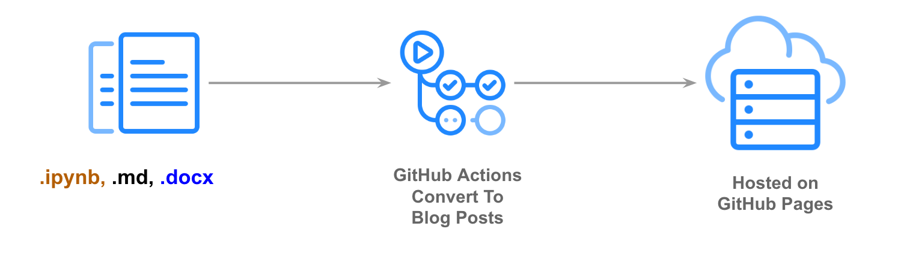

# Welcome!

Welcome to my blog! Here I will post about some of the things I'm working on that I feel are worth sharing to a wider audience, from beginner to advanced topics broadly within ML.

My main page can be found [here](dthiagarajan.github.io). If you want to reach out to me, you can email me [here](mailto:dthiagar@gmail.com).

## Posts

## About This Page

This site is built with [fastpages](https://github.com/fastai/fastpages), An easy to use blogging platform with extra features for Jupyter Notebooks.

[fastpages](https://github.com/fastai/fastpages) automates the process of creating blog posts via GitHub Actions, so you don't have to fuss with conversion scripts.  A full list of features can be found on [GitHub](https://github.com/fastai/fastpages).  